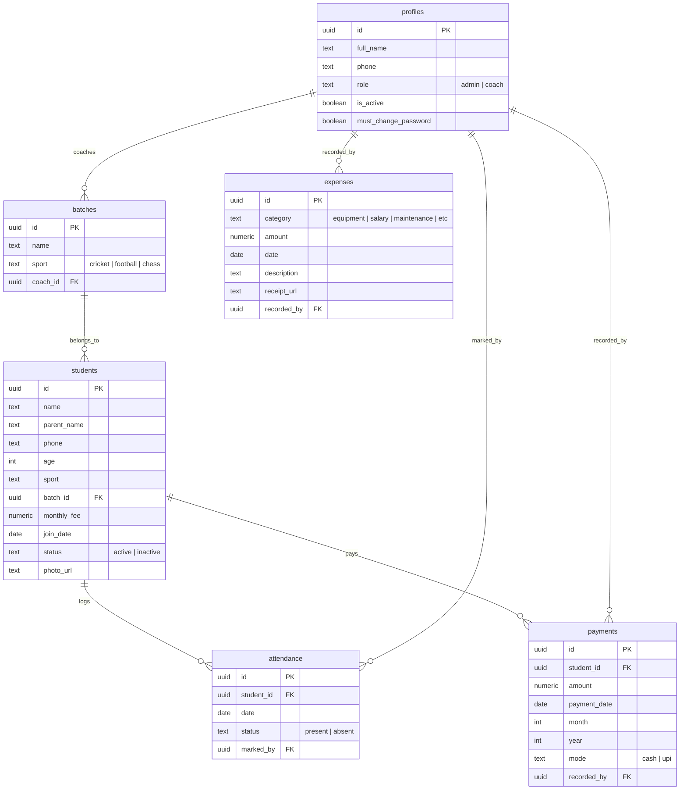

# 🏆 Sports Academy Management App

A premium, mobile-first Sports Academy Management application built with **Flutter** and **Supabase**. The app features a highly tailored design system, robust role-based security policies, and comprehensive management features for academies handling sports like Cricket, Football, and Chess.

---

## 📱 Visual Design System

The app is styled using a custom, high-end design system (Sports Academy Design System V2.0):
* **Dual Theme Modes**:
  - 🌌 **Midnight Sapphire (Dark)**: Deep warm charcoal-slate surfaces (`#161513`) with subtle beige undertones.
  - 🍦 **Warm Ivory (Light)**: Premium cream-sand tones (`#EFE4CE`) for an elegant, non-glare visual hierarchy.
* **Accent Colors**: Elegant Gold (`#C67D15`), Warm Terracotta/Coral (`#E76F51`), Ocean Blue (`#38BDF8`), and Royal Purple (`#B685FF`) for Chess.
* **Layout Constraints**: The interface is constrained to a maximum width of **395px** with smooth shadows on desktop and web views, rendering a beautiful interactive mobile-device preview on large screens.

---

## 🌟 Core Features

### 🔐 1. Role-Based Access & Security (RLS)
Security is enforced at the database level using PostgreSQL **Row Level Security (RLS)**:
* **Admin**:
  - Full management of profiles (coaches/staff).
  - Create and edit batches and student records.
  - Log fees/payments and track academy expenses.
  - Full financial reports and analytical graph access.
* **Coach**:
  - View only their assigned batches and students.
  - View, mark, and track attendance records for their specific students.
  - Blocked entirely from accessing financial data (payments and expenses).

### 📊 2. Operations & Actions Hub
A consolidated control panel to manage day-to-day operations:
* **Student Directory**: Profile creation, join date tracking, age-sport grouping, status toggle (Active/Inactive), and profile image uploading.
* **Attendance Ledger**: Single-tap daily registers to log student attendance (`Present` / `Absent`).
* **Fee Collection**: Logs fee amounts, payment date, billing month, and transaction mode (`Cash` / `UPI`).
* **Expense Management**: Track outgoings categorized by ground/pitch preparation, equipment, salaries, constructions, and maintenance, including receipt attachment uploads.
* **Batch Scheduler**: Group students into batches linked to specific sports and coaches.
* **Reports & Financial Graphs**: Interactive graphs utilizing `fl_chart` to contrast income vs. expenses, analyze outstanding student dues, and forecast revenues.

---

## 🛠️ Technology Stack

* **Framework**: [Flutter](https://flutter.dev) (Dart SDK `^3.12.2`)
* **Backend-as-a-Service**: [Supabase](https://supabase.com) (Authentication, Database, Row Level Security, Storage Buckets)
* **State Management**: [Riverpod](https://riverpod.dev) (`flutter_riverpod`)
* **Navigation**: [GoRouter](https://pub.dev/packages/go_router) (dynamic page-routing with custom slide & fade transition presets)
* **Database Modeling**: PostgreSQL views (e.g., `student_dues` tracking monthly calculations)

---

## 🗄️ Database Architecture

The Supabase database schema consists of the following key tables:



### Key Views
* **`student_dues`**: Calculates cumulative expected fees since join date against total payment history to track pending dues per student automatically.

---

## 🚀 Getting Started

### 1. Prerequisites
* [Flutter SDK](https://docs.flutter.dev/get-started/install) installed locally.
* A [Supabase account and project](https://supabase.com/).

### 2. Configuration Setup
Create a `config.json` file in the root directory of your project:

```json
{
  "SUPABASE_URL": "https://your-project-ref.supabase.co",
  "SUPABASE_ANON_KEY": "your-supabase-anonymous-key"
}
```

*Note: You can copy `.env.example` as a reference for environment variables.*

### 3. Local Execution
Run the following command to download dependencies and launch the application:

```bash
flutter pub get
flutter run --dart-define-from-file=config.json
```

### 4. Build APK (Android Release)
To build a production release APK:

```bash
flutter build apk --release --dart-define-from-file=config.json
```

*Developer Tip: If building on Windows with your project workspace located on a different drive (e.g. `E:`) than your AppData/Gradle directory (e.g. `C:`), Kotlin incremental compilation is disabled (`kotlin.incremental=false` in `android/gradle.properties`) to circumvent the multi-root filesystem relative path resolution crash.*
